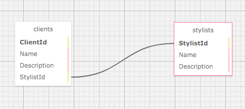

# _Eau Claire's Salon_

#### _A program to allow Eau Claire's Salon to keep track of stylists and clients._
##### _Date Created: May 22nd 2021_
##### _Date Updated: May 31st 2021_

#### By _**Garrett Brown**_

## Description
_A program that allows Eau Claire's Salon to keep track of Stylists and Clients. Users can create stylists, clients, and assorted details. Users can also keep track of which clients are assigned to which stylists. Users can also edit or delete details._

### User Stories

    
Expand

#### User Stories
* _As the salon owner, I need to be able to see a list of all stylists._
* _As the salon owner, I need to be able to select a stylist, see their details, and see a list of all clients that belong to that stylist._
* _As the salon owner, I need to add new stylists to our system when they are hired._
* _As the salon owner, I need to be able to add new clients to a specific stylist. I should not be able to add a client if no stylists have been added._

## Setup/Installation Requirements

### Installation

* _Open the terminal on your local machine and navigate to "Desktop."_
* _Clone "Salon.Solution"" with the following git command `git clone https://github.com/GBProductions/Salon.Solution.git`_
* _Navigate to the top level of the repository with the command `cd Salon.Solution`_
* _Navigate into "HairSalon" with git command `cd HairSalon`_
* _Restore project with git command `dotnet restore`_
* _Build project with git command `dotnet build`_
* _To run program, run git command `dotnet run`_

### Recreate Database

## Known Bugs

_There are currently no known bugs._

## Support and contact details

_For assistance, please contact Garrett Brown <garrettpaulbrown@gmail.com>_

## Technologies Used

* _Github, VS Code_
* _Bootstrap_
* _Entity Framework_
* _C#_
* _.NET Core 5.0.1_
* _ASP.NE Core MVC_
* _ASP.NET Core Razor Pages_
* _HTML, CSS_
* _MySQL_
* _MyuSQL Workbench_

### License

*Available under MIT Licensing*

Copyright (c) 2021 **_Garrett Brown_**
